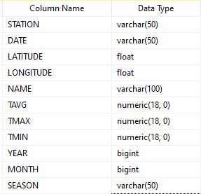

# Weather API

## 1. Architecture

I have used SQL server as data store and developed the database locally. I have also used Flask to build the API to serve data requests.


The database table is designed as follows:


## 2. ETL
With the requests library in python, I pulled the tar.gz data folder from the link provided and extracted the contents to a local folder. Iterating over the 118k csv files, I select the files that have the required columns to meet the use case requirements: location, average temperature, year and month. A lot of files did not have the required temperature columns. These files were discarded since the requirements only requested results where data existed. 

Data transformation was done in pandas to map months to seasons and create a column for year. The final table was saved to a comma delimited file which was ingested into the SQL Server database with SSIS. This is a faster approach than writing to database directly from pandas. 

Code for this is in the `etl.py` file.

## 3. API Implementation

The API is built in Flask which is deployed locally. Python dependencies are specified in `requirements.txt`.

In order to manage performance, it is set to return only 100 records per API call.

### Methods
#### /temperature GET
This endpoint returns average seasonal temperature for each season and year where data is available

```
Sample response:
{
    "nextURL": "http://localhost:5000/temperature?pageNum=1",
    "status": "ok"
    "data": [
    {
      "season": "Spring",
      "tavg": 9.358373,
      "year": 2004
    },
    {
      "season": "Winter",
      "tavg": 0.830639,
      "year": 2021
    }
    ]
    
}
```

#### /stations GET
Returns list of weather stations and number of available datapoints (i.e. non-null temperature entries) for
each season and year where data is available

sample response:
```{
    "nextURL": "http://localhost:5000/stations?pageNum=1",
    "status": "ok"
    data: [
        {
        "data_points": 2,
        "season": "Summer",
        "station": "AE000041196",
        "year": 1993
        },
        {
        "data_points": 3,
        "season": "Fall",
        "station": "AE000041196",
        "year": 1993
        }
    ]
}
```
#### getTempByLocation POST
Accepts 2 sets of coordinates (lat1, lon1, lat2, lon2) and 2 integers (startYear and endYear) as
parameters to serve average temperature and available datapoints similar to above. The data should be
averaged over the rectangular area defined by supplied coordinates (lat1, lon1) and (lat2, lon2). Data is
 also averaged over startYear-endYear range. It also attempts to identify the country which one of the geometry points fall into.

sample request
```
{
    "lat1":37,
    "lat2":40,
    "lon1":-80,
    "lon2":-70,
    "startYear":1989,
    "endYear":2001

}
```

sample response
```
{
    "nextURL": "http://localhost:5000/getTempByLocation?pageNum=1",
    "status": "ok",
    "country": "United States",
    "data": [
        {
            "season": "Summer",
            "tavg": 14.05031,
            "year": 1915
        },
        {
            "season": "Winter",
            "tavg": -0.593787,
            "year": 1922
        }
        ]
}
```
